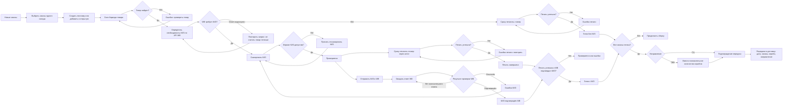

# Сборка, КИЗ, печать и доставка

[Открыть редактируемую схему в FigJam](https://www.figma.com/online-whiteboard/create-diagram/579c0d98-2bf7-444c-a1f3-49fdfd50c54a)

```mermaid
flowchart LR
orders["Новые заказы"] --> select["Выбрать заказы одного склада"]
select --> supply["Создать поставку или добавить в открытую"]
supply --> scan["Скан баркода товара"]
scan --> found{"Товар найден?"}
found -->|"Нет"| wrong["Ошибка: проверить товар"]
wrong --> scan
found -->|"Да"| required["Определить необходимость КИЗ по API WB"]
required --> need{"WB требует КИЗ?"}
need -->|"Ответ недоступен"| retryApi["Повторить запрос: не считать товар готовым"]
retryApi --> required
need -->|"Нет"| plainPrint["Сразу печатать стикер"]
plainPrint --> plainOk{"Печать успешна?"}
plainOk -->|"Нет"| plainError["Ошибка печати"]
plainError --> plainPrint
plainOk -->|"Да"| plainReady["Готов без КИЗ"]
need -->|"Да"| kiz["Сканировать КИЗ"]
kiz --> format{"Формат КИЗ допустим?"}
format -->|"Нет"| formatError["Просить отсканировать КИЗ"]
formatError --> kiz
format -->|"Да"| checking["Проверяется"]
checking --> print["Сразу печатать стикер через агент"]
checking --> submit["Отправить КИЗ в WB"]
print --> printOk{"Печать успешна?"}
printOk -->|"Нет"| printError["Ошибка печати: повторить"]
printError --> print
printOk -->|"Да"| printed["Печать завершена"]
submit --> wait["Ожидать ответ WB"]
wait --> result{"Результат проверки WB"}
result -->|"Нет окончательного ответа"| wait
result -->|"Отклонён"| kizError["Ошибка КИЗ"]
kizError --> kiz
result -->|"Подтверждён"| approved["КИЗ подтверждён WB"]
printed --> gate{"Печать успешна и WB подтвердил КИЗ?"}
approved --> gate
gate -->|"Нет"| pending["Проверяется или ошибка"]
gate -->|"Да"| ready["Готов с КИЗ"]
ready --> all{"Все заказы готовы?"}
plainReady --> all
all -->|"Нет"| next["Продолжить сборку"]
all -->|"Да"| destination{"Направление"}
destination -->|"СЦ"| confirm["Подтверждение передачи"]
destination -->|"ПВЗ"| boxes["Ввести положительное количество коробов"]
boxes --> confirm
confirm --> shipped["Передана в доставку: дата, заказы, короба, направление"]
```
