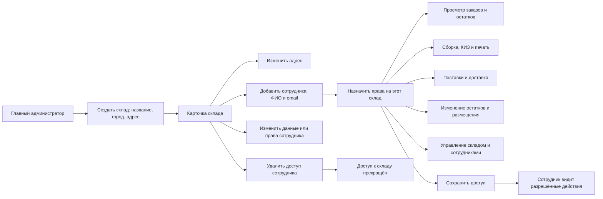

# Склады, сотрудники и права

[Открыть редактируемую схему в FigJam](https://www.figma.com/board/1dnVTLbZ0GRNA0h0rYqtxu)

```mermaid
flowchart LR
admin["Главный администратор"] --> warehouse["Создать склад: название, город, адрес"]
warehouse --> card["Карточка склада"]
card --> address["Изменить адрес"]
card --> add["Добавить сотрудника: ФИО и email"]
add --> rights["Назначить права на этот склад"]
rights --> view["Просмотр заказов и остатков"]
rights --> assembly["Сборка, КИЗ и печать"]
rights --> delivery["Поставки и доставка"]
rights --> stock["Изменение остатков и размещения"]
rights --> manage["Управление складом и сотрудниками"]
rights --> save["Сохранить доступ"]
save --> employee["Сотрудник видит разрешённые действия"]
card --> edit["Изменить данные или права сотрудника"]
card --> remove["Удалить доступ сотрудника"]
remove --> blocked["Доступ к складу прекращён"]
```
