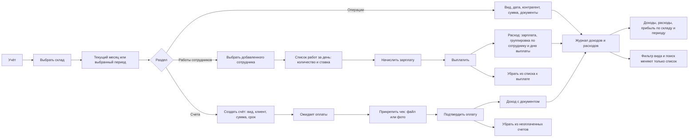

# Учёт, зарплата и счета

[Открыть редактируемую схему в FigJam](https://www.figma.com/online-whiteboard/create-diagram/87c85577-c8bf-4842-9ef9-f52166fdfee2)

```mermaid
flowchart LR
start["Учёт"] --> warehouse["Выбрать склад"]
warehouse --> period["Текущий месяц или выбранный период"]
period --> section{"Раздел"}
section -->|"Операции"| operation["Вид, дата, контрагент, сумма, документы"]
operation --> ledger["Журнал доходов и расходов"]
ledger --> totals["Доходы, расходы, прибыль по складу и периоду"]
ledger --> filter["Фильтр вида и поиск меняют только список"]
section -->|"Работы сотрудников"| employee["Выбрать добавленного сотрудника"]
employee --> tasks["Список работ за день: количество и ставка"]
tasks --> accrued["Начислить зарплату"]
accrued --> paid["Выплатить"]
paid --> expense["Расход: зарплата, группировка по сотруднику и дню выплаты"]
expense --> ledger
paid --> hide["Убрать из списка к выплате"]
section -->|"Счета"| invoice["Создать счёт: вид, клиент, сумма, срок"]
invoice --> pending["Ожидает оплаты"]
pending --> receipt["Прикрепить чек: файл или фото"]
receipt --> payment["Подтвердить оплату"]
payment --> income["Доход с документом"]
income --> ledger
payment --> hidden["Убрать из неоплаченных счетов"]
```
